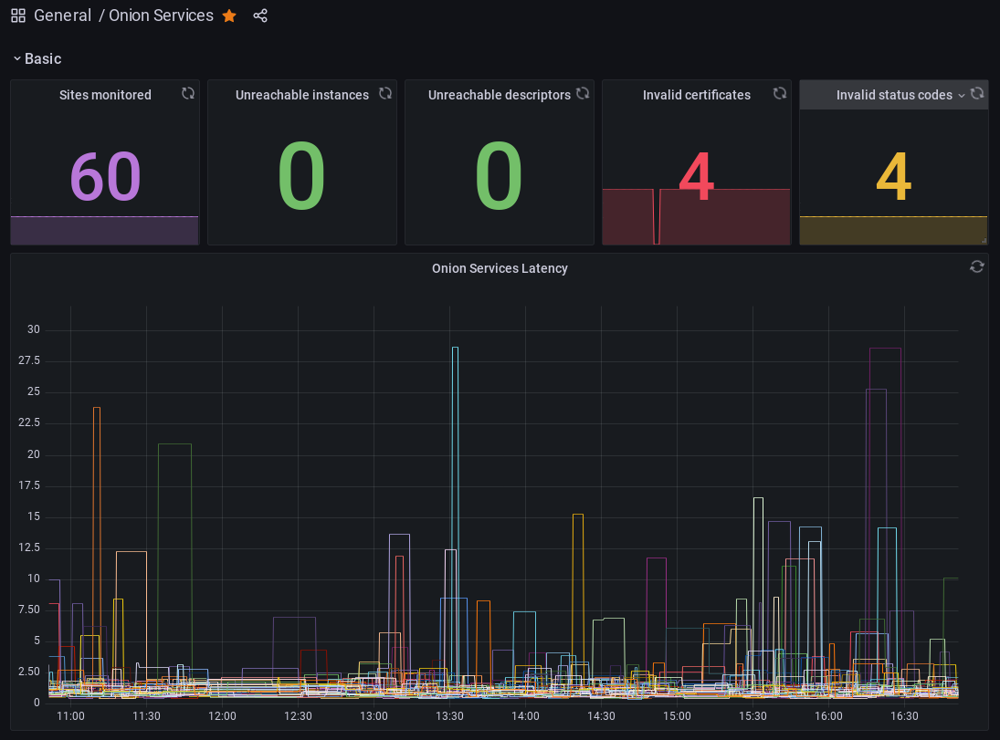

# Standalone monitoring node

Onionprobe comes with full monitoring environment based on [Docker
Compose](https://docs.docker.com/compose/) with:

* An Onionprobe instance continuously monitoring endpoints.
* Metrics are exported to a [Prometheus](https://prometheus.io) instance.
* Alerts are managed using [Alertmanager](https://prometheus.io/docs/alerting/latest/alertmanager/).
* A [Grafana](https://grafana.com) Dashboard is available for browsing the
  metrics and using a PostgreSQL service container as the database backend.

## Configuring the monitoring node

By default, the monitoring node periodically compiles the Onionprobe configuration
from the official Tor Project Onion Services into `contrib/tpo.yaml`, by using
the [tpo.py script][packages.tpo].

This and other configurations can be changed by creating an `.env` file in the
toplevel project folder.

Check the [sample .env][] for an example.

[sample .env]: https://gitlab.torproject.org/tpo/onion-services/onionprobe/-/blob/main/configs/env.sample

## Starting the monitoring node

The monitoring node may be started using `docker-compose`:

    docker-compose up -d   # Remove "-d" to not fork into the background
    docker-compose logs -f # View container logs

The monitoring node sets up [storage
volumes](https://docs.docker.com/storage/volumes/), which means that the
monitoring dataset collected is persistent across service container reboots.

## Accessing the monitoring dashboards and the exporter

Once the dashboards are started, point your browser to the following addresses
if you're running locally:

* The built-in Prometheus   dashboard: http://localhost:9090
* The built-in Alertmanager dashboard: http://localhost:9093
* The built-in Grafana      dashboard: http://localhost:3030
* The built-in Onionprobe   Prometheus exporter: http://localhost:9935

These services are also automatically exported as Onion Services,
which addresses can be discovered by running the following commands
when the services are running:

    docker exec -ti onionprobe_tor_1 cat /var/lib/tor/prometheus/hostname
    docker exec -ti onionprobe_tor_1 cat /var/lib/tor/alertmanager/hostname
    docker exec -ti onionprobe_tor_1 cat /var/lib/tor/grafana/hostname
    docker exec -ti onionprobe_tor_1 cat /var/lib/tor/onionprobe/hostname

You can also get this info from the host by browsing directly the
`onionprobe_tor` volume.

It's also possible to replace the automatically generated Onion Service
addresses by using keys with vanity addresses using a tool like
[Onionmine](https://gitlab.torproject.org/tpo/onion-services/onionmine).

## Protecting the monitoring dashboards and the exporter

By default, all dashboards and the are accessible without credentials.

You can protect them by [setting up Client
Authorization](https://community.torproject.org/onion-services/advanced/client-auth/):

0. Enter in the `tor` service container: `docker exec -ti onionprobe_tor_1 /bin/bash`.
1. Setup your client credentials [according to the docs](https://community.torproject.org/onion-services/advanced/client-auth/).
   The `tor` service container already comes with all programs to generate it.
   Onionprobe ships with a handy
   [generate-auth-keys-for-all-onion-services](scripts/generate-auth-keys-for-all-onion-services)
   available at the `tor` service container and which can be invoked with
  `docker exec -ti onionprobe_tor_1 /usr/local/bin/generate-auth-keys-for-all-onion-services`
  (it also accepts an optional auth name parameter allowing multiple credentials to be deployed).
2. Place the `.auth` files at the Onion Services `authorized_clients` folder if you did not
   created them with the `generate-auth-keys-for-all-onion-services` script:
    * Prometheus: `/var/lib/tor/prometheus/authorized_clients`.
    * Alertmanager: `/var/lib/tor/alertmanager/authorized_clients`.
    * Grafana: `/var/lib/tor/grafana/authorized_clients`.
    * Onionprobe: `/var/lib/tor/onionprobe/authorized_clients`.
3. Restart the `tor` service container from the host to ensure that this new
   configuration is applied:

        docker compose stop tor
        docker compose up -d

Note that the Grafana dashboard also comes with it's own user management system,
whose default user and password is `admin`. You might change this default user
and not setup the Client Authorization for Grafana, or maybe use both depending
or your security needs.

## Managing the monitoring node with systemd

The monitoring node can be managed with systemd.
A [sample service file][] is provided
and can be adapted..

[sample service file]: https://gitlab.torproject.org/tpo/onion-services/onionprobe/-/blob/main/configs/systemd/onionprobe-monitor.service

## Using the monitoring node

Once your monitoring node is up and running, you can create your dashboards an
visualizations as usual, getting the data compiled by Onionprobe using
Prometheus as the data source.

Grafana already comes with a basic default dashboard as it's homepage:

